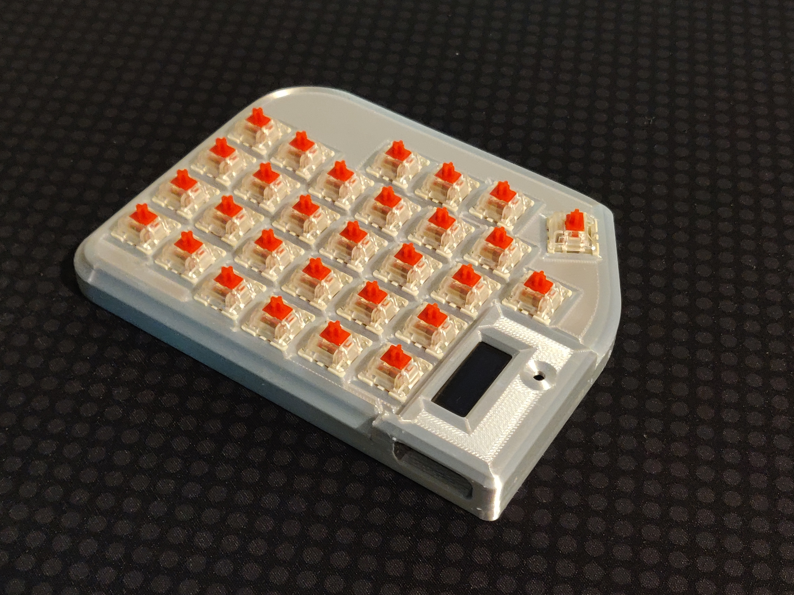

# Lily58 rev 1 Case Assembly

This case was generated as an alternative to the plate "sandwich" style cases.  It feel more solid and provides protection for the entire PCB including the controller and display.

While this is for an older Lily58, it should work on other PCBs as long as the keys are in the same place.  Currently, the case expects the presence of Mill-Max sockets, offsetting the switches in z ~.7mm.  I am working to modify the geometry for a direct solder version.  The Mill-Max version should still work, but will not stabilize the switches as effectively due to the gap.

I have not tried it on any other version so I cannot guarantee its fit.  If you try it and see issues, please share images and measurements and I will try to create additional versions and build information to the repo.  I can be reached on Reddit as [j_oshreve](https://www.reddit.com/user/j_oshreve/).

## Parts
| components |  qty |  description  |
|--------|-------|-------|
|Lily58 PCB | 2 ||
|Case Top Left | 1 ||
|Case Top Right | 1 ||
|Case Base Left | 1 ||
|Case Base Right | 1 ||
|Controller Cover Left | 1 ||
|Controller Cover Right | 1 ||
| M3 X 6 self tapping pan head screw | 10 | Mounts PCB to top cover |
| M2.6 X 10 self tapping pan head screw | 22 | 6 X Mounts controller cover to top cover, 16 X Mount base to top cover|
| M2.3 X 5 self tapping pan head screw | 2 | Mounts PCB to controller cover.  Optional, but helps stabilize the controller cover|
|ProMicro|2| See original build files for more info|
| OLED |2| I used "Geekcreit 0.91 Inch 128x32 IIC I2C Blue OLED LCD Display SSD1306" but any 4 pin SSD1306 with 128X32 should work.|
|MX compatible switches | 58pcs | |
|Keycaps | 1U X 56, 1.5U/1U X 2||
|Diode 1N4148|58||
|Mill-Max sockets 0305-2-15-80-47-80-10-0|116| Other sockets with comparable dimensions should work.|
|tactile switches |2| reset switches|
|TRRS jack|2||
|TRS(TRRS) cable| 1 | 3 or 4 pole audio cable|
|MicroUSB cable| 1 ||

## Build the PCB
See original build guide.  Only added components are soldering Mill-Max sockets into the switch holes instead of soldering the switches directly to the PCB.  I suggest putting them all in from the front and taping them all on the front face.  Then solder all the sockets into place from the back.  If any are sticking out, clean the soldering iron (to prevent getting solder in the socket) and press the socket from the front until the solder melts and the socket pushes in until properly seated.  

## Install in the case
__!!!  All quantities in install instructions are per side  !!!__

Install the PCB for each side into the top cover with 5 screws (M3 X 6).  You can now test install a few switches to make sure the fit is good.  If so, you can install additional switches or test firmware before building the rest.  Be careful to feel the switch install.  If pins are misaligned to Mill-Max sockets they will bend.

Install the controller cover for each side with 3 screws (M2.6 X 10).  Optionally add the extra screw to attach the controller cover to the PCB for stability (M2.3 X5).

Install the base with 8 screws (M2.6 X 10) and add rubber feet or other stick on pads for friction / stabilization.

Add caps and cables.

## Assembly Complete

## Next Steps

Future planned work to include a tented version of the base plate along with a version integrating a Ploopy Nano.  While a full custom trackball is preferred, the lily58 controller does not have the necessary pins open to implement, so an mechanical only integration of the Ploopy Nano is a more logical path. 